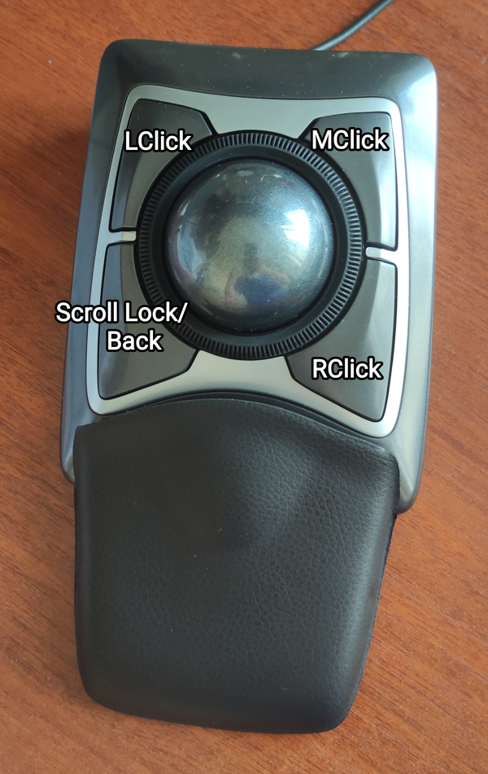
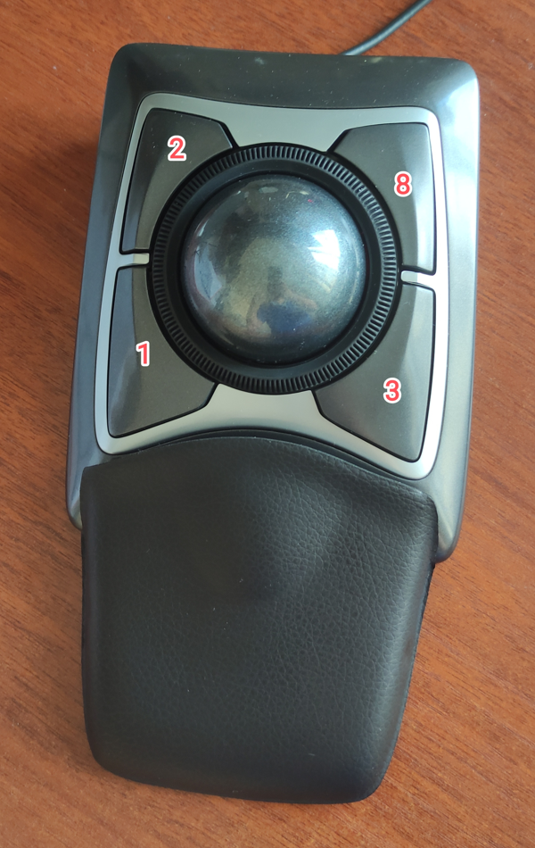
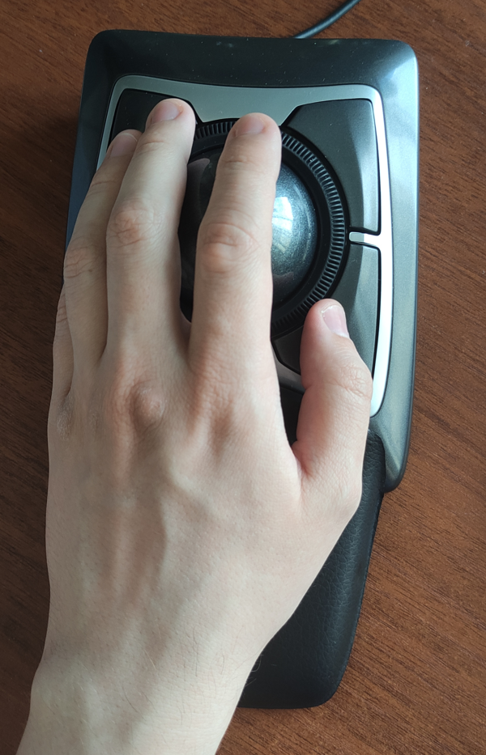

# Kensington Expert Trackball Linux Config
This is a configuration script for the Kensington Expert Wired trackball
that remaps the buttons and edits some props.
This scripts dependencies are `xinput`, `grep` and `sed` 
which should be installed on all distros by default.
There are comments in the script which should help you setup your own config.

## Layout | Buttons Map
If you run the script as it is without changing anything this will be your layout:

Positions of buttons in config:

It is design to work with left hand:

## Settings applied
1. Reassign buttons to new positions.
2. Acceleration enabled (`Normal` speed). Three options for acceleration: `Off`, `Normal`, `Fast`.
3. Fast scrolling by press/hold button and moving ball. 
`Scroll Lock` over `Back` button (can be changed in script).
    - (Default) Press and release button `Scroll Lock` (position 1) and move ball.
    - (Optional) Press and hold `Right click` (position 3) by thumb and move ball.
4. (Optional) You can change fast scrolling speed (ball+button). Range: 10 (fastest) - 50 (slowest) (default 15).

## Usage
You can run the script simpy by calling the script `./kensington_expert_setup.sh` there is no need for root.

Or a better way is to put it in your desktop environment or window manager config, so that it runs when you login, the script also checks if the trackball is present before running any commands so its safe to use it like this.

I use i3 window manager so I put this in my i3 config `exec_always --no-startup-id ~/.config/i3/kensington_expert_setup.sh`
